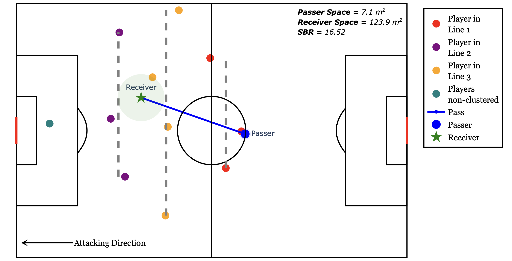

# BreakLines: Uncovering Tactical Line-Breaking Passes
This repo consists of codes, presentations and other details of the Breaklines Project

> *An unsupervised, interpretable framework for detecting and analysing line-breaking passes (LBPs) using spatiotemporal football data.*



## Overview

Line-breaking passes (LBPs) are a cornerstone of vertical progression and attacking structure in football. This project introduces a clustering-based method to detect LBPs from synchronised event and tracking data, modelling opponent defensive shape dynamically at the moment of each pass.

BreakLines further introduces two key tactical metrics:
- **SBR (Space Buildup Ratio):** Quantifies the spatial advantage gained from a pass.
- **LBPCh¹ & LBPCh²:** Capture direct and chained progression sequences that culminate in goal-scoring attempts.

Our approach combines spatial logic with tactical relevance to uncover the structure behind dangerous build-up sequences — without relying on proprietary labels or pre-defined formations.

## 📄 Paper

Read the full paper here:  
➡️ [Through the Gaps: Uncovering Tactical Line-Breaking Passes with Clustering](https://arxiv.org/abs/2506.06666)

## 🔧 Features

- 🧠 **Unsupervised Clustering:** Dynamic vertical segmentation of defensive lines using K-Means with adaptive `k` (≥2 clusters).
- 📊 **SBR Metric:** Interpretable spatial impact score based on area expansion around receivers.
- 🔄 **Chain Analysis:** Detection of chained LBPs (LBPCh²) for sustained vertical build-ups.
- ⚽ **Player/Team Analysis:** Identify top line-breakers, space creators, and tactical contributors.

## 🗃️ Dataset

Uses the [PFF FC World Cup 2022 Dataset](https://www.blog.fc.pff.com/blog/pff-fc-release-2022-world-cup-data) which includes:
- Event data (passes, duels, shots)
- Tracking data at 29.97Hz for all players and ball
- Roster, meta, and alignment information for full context

## 📂 Folder Structure
```verbatim
breaklines/
│
├── figures/             # Paper and visualization assets
├── codes/               # Jupyter analysis notebooks
├── src/                 # Core scripts for clustering, SBR, LBPCh
├── videos/              # Video recording for the presentations
└── README.md
```

## 📌 Citation
```verbatim
@article{karakus2025breaklines,
  title={Through the Gaps: Uncovering Tactical Line-Breaking Passes with Clustering},
  author={Karakus, Oktay and Arkadaş, Hasan},
  journal={arXiv preprint arXiv:XXXX.XXXXX},
  year={2025}
}
```

> Made with ❤️ by [Dead Ball Analytics](https://deadballanalytics.substack.com/) and Cardiff University

> Contact: Dr Oktay Karakus: [karakuso@cardiff.ac.uk](mailto:karakuso@cardiff.ac.uk)
